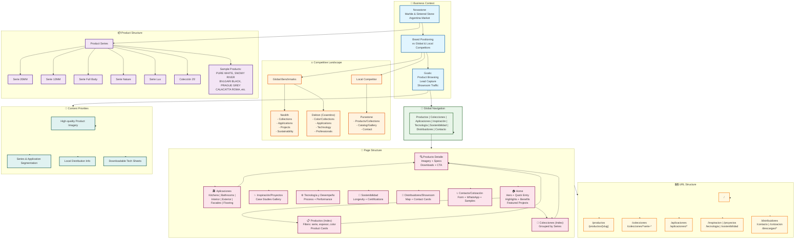

# Novastone Project Context - Mermaid Diagram

```mermaid
graph TB
    %% Business Context
    subgraph Business["🏢 Business Context"]
        Novastone["Novastone<br/>Marble & Sintered Stone<br/>Argentina Market"]
        Positioning["Brand Positioning<br/>vs Global & Local Competitors"]
        Goals["Goals:<br/>Product Browsing<br/>Lead Capture<br/>Showroom Traffic"]
    end

    %% Competitive Landscape
    subgraph Competition["⚔️ Competitive Landscape"]
        Global["Global Benchmarks"]
        Neolith["Neolith<br/>- Collections<br/>- Applications<br/>- Projects<br/>- Sustainability"]
        Dekton["Dekton (Cosentino)<br/>- Color/Collections<br/>- Applications<br/>- Technology<br/>- Professionals"]
        Local["Local Competitor"]
        Purastone["Purastone<br/>- Products/Collections<br/>- Catalog/Gallery<br/>- Contact"]
    end

    %% Product Structure
    subgraph Products["📦 Product Structure"]
        Series["Product Series"]
        Serie20["Serie 20MM"]
        Serie12["Serie 12MM"]
        SerieFB["Serie Full Body"]
        SerieESP["Serie Nature"]
        SerieLUX["Serie Lux"]
        Col25["Colección 25'"]
        Samples["Sample Products:<br/>PURE WHITE, SNOWY RIVER<br/>BVLGARI BLACK, PRAGUE GREY<br/>CALACATTA ROMA, etc."]
    end

    %% Website Architecture
    subgraph Navigation["🧭 Global Navigation"]
        NavItems["Productos | Colecciones |<br/>Aplicaciones | Inspiración |<br/>Tecnología | Sostenibilidad |<br/>Distribuidores | Contacto"]
    end

    subgraph Pages["📄 Page Structure"]
        Home["🏠 Home<br/>Hero + Quick Entry<br/>Highlights + Benefits<br/>Featured Projects"]
        ProductosIndex["📋 Productos (Index)<br/>Filters: serie, espesor, color<br/>Product Cards"]
        ColeccionesIndex["🎨 Colecciones (Index)<br/>Grouped by Series"]
        ProductoDetail["🔍 Producto Detalle<br/>Imagery + Specs<br/>Downloads + CTA"]
        Aplicaciones["🏛️ Aplicaciones<br/>Kitchens | Bathrooms |<br/>Interior | Exterior |<br/>Facades | Flooring"]
        Inspiracion["✨ Inspiración/Proyectos<br/>Case Studies Gallery"]
        Tecnologia["⚙️ Tecnología y Desempeño<br/>Process + Performance"]
        Sostenibilidad["🌱 Sostenibilidad<br/>Longevity + Certifications"]
        Distribuidores["📍 Distribuidores/Showroom<br/>Map + Contact Cards"]
        Contacto["📞 Contacto/Cotización<br/>Form + WhatsApp + Samples"]
    end

    subgraph Sitemap["🗺️ URL Structure"]
        Root["/"]
        ProductRoutes["/productos<br/>/productos/{slug}"]
        CollectionRoutes["/colecciones<br/>/colecciones/*serie-*"]
        AppRoutes["/aplicaciones<br/>/aplicaciones/*"]
        ContentRoutes["/inspiracion | /proyectos<br/>/tecnologia | /sostenibilidad"]
        UtilityRoutes["/distribuidores<br/>/contacto | /cotizacion<br/>/descargas/*"]
    end

    subgraph Priorities["🎯 Content Priorities"]
        Prior1["High-quality Product Imagery"]
        Prior2["Series & Application Segmentation"]
        Prior3["Local Distribution Info"]
        Prior4["Downloadable Tech Sheets"]
    end

    %% Relationships
    Novastone --> Positioning
    Positioning --> Goals
    Positioning --> Global
    Positioning --> Local
    Global --> Neolith
    Global --> Dekton
    Local --> Purastone

    Novastone --> Series
    Series --> Serie20
    Series --> Serie12
    Series --> SerieFB
    Series --> SerieESP
    Series --> SerieLUX
    Series --> Col25
    Series --> Samples

    Goals --> Navigation
    Navigation --> NavItems
    NavItems --> Pages

    Pages --> Home
    Pages --> ProductosIndex
    Pages --> ColeccionesIndex
    Pages --> ProductoDetail
    Pages --> Aplicaciones
    Pages --> Inspiracion
    Pages --> Tecnologia
    Pages --> Sostenibilidad
    Pages --> Distribuidores
    Pages --> Contacto

    Home --> ProductosIndex
    Home --> ColeccionesIndex
    ProductosIndex --> ProductoDetail
    ColeccionesIndex --> ProductoDetail
    Aplicaciones --> ProductoDetail

    Pages --> Sitemap
    Sitemap --> Root
    Sitemap --> ProductRoutes
    Sitemap --> CollectionRoutes
    Sitemap --> AppRoutes
    Sitemap --> ContentRoutes
    Sitemap --> UtilityRoutes

    Goals --> Priorities
    Priorities --> Prior1
    Priorities --> Prior2
    Priorities --> Prior3
    Priorities --> Prior4

    %% Styling
    classDef business fill:#e1f5ff,stroke:#01579b,stroke-width:2px
    classDef competition fill:#fff3e0,stroke:#e65100,stroke-width:2px
    classDef product fill:#f3e5f5,stroke:#4a148c,stroke-width:2px
    classDef navigation fill:#e8f5e9,stroke:#1b5e20,stroke-width:2px
    classDef page fill:#fce4ec,stroke:#880e4f,stroke-width:2px
    classDef sitemap fill:#fff8e1,stroke:#f57f17,stroke-width:2px
    classDef priority fill:#e0f2f1,stroke:#004d40,stroke-width:2px

    class Novastone,Positioning,Goals business
    class Global,Neolith,Dekton,Local,Purastone competition
    class Series,Serie20,Serie12,SerieFB,SerieESP,SerieLUX,Col25,Samples product
    class Navigation,NavItems navigation
    class Home,ProductosIndex,ColeccionesIndex,ProductoDetail,Aplicaciones,Inspiracion,Tecnologia,Sostenibilidad,Distribuidores,Contacto page
    class Root,ProductRoutes,CollectionRoutes,AppRoutes,ContentRoutes,UtilityRoutes sitemap
    class Prior1,Prior2,Prior3,Prior4 priority
```
